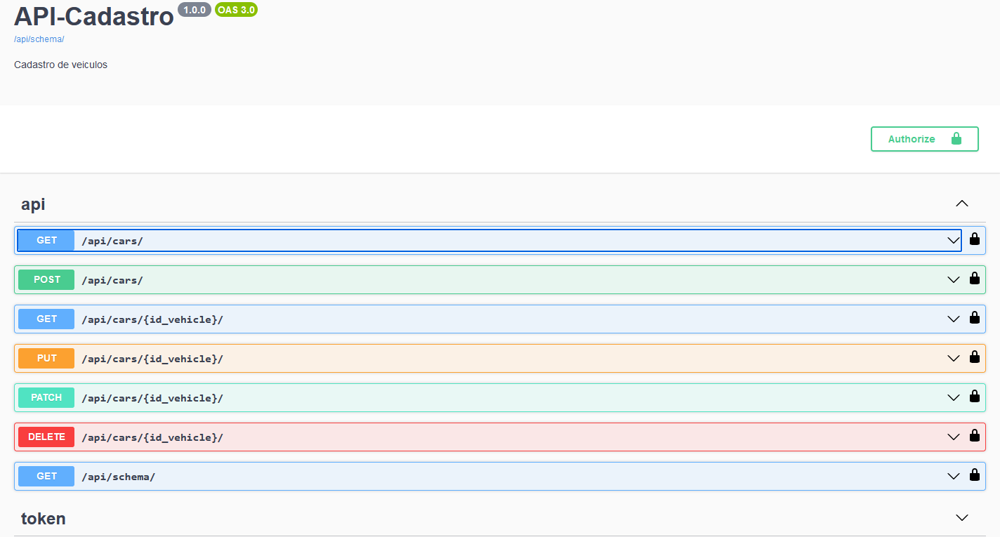
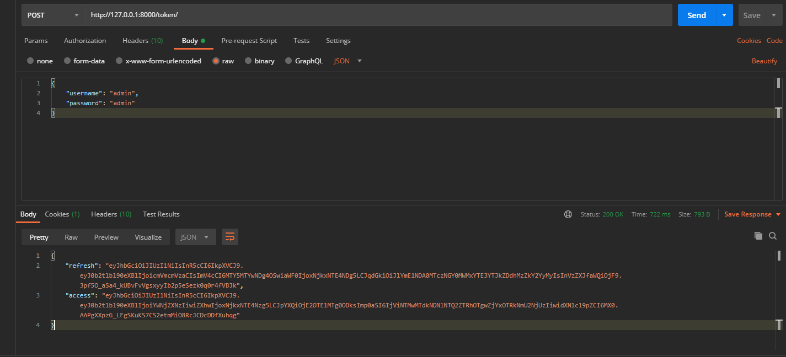

# Django-RestFramework-API
🚘 API in django-rest-framework made for a vehicle registration system with authentication.

## Introduction

Welcome to the official documentation of the Vehicle Management REST API! This API was developed using the Django-Rest-Framework and aims to provide endpoints for creating, reading, updating and deleting vehicle records. Through this documentation, you will learn how to interact with the API, how to make the most of its functionalities and how to explore its features in an interactive way.
Overview

The Vehicle Management API follows the principles of REST architecture, allowing communication between systems in an efficient and standardized way. It provides an interface to interact with the "Vehicle" entity, allowing you to perform CRUD (Create, Read, Update, Delete) operations on these records.

A notable feature of this API is the integration of Swagger, an interactive documentation tool, which allows developers to explore and test endpoints in an intuitive way. In addition, the use of ReDoc offers a simplified and visually appealing documentation experience.

## Installation

1. Clone the repository:
```bash
git clone https://github.com/rychardbarros/Django-RestFramework-API.git
cd Django-RestFramework-API
```
2. Create and activate a virtual environment (optional but recommended):
```bash
pip install virtualenv
python -m venv venv

# On Windows
venv\Scripts\activate

# On Linux/Mac
source venv/bin/activate
```
3. Install the dependencies:
```bash
install -r requirements.txt
```
## To run the Django-RestFramework-API, follow the steps below:
Open a terminal or command prompt.
Navigate to the directory:
```bash
cd path/to/the/Django-RestFramework-API
```
Start the crud:
```bash
python manage.py runserver
```

## Authentication

To access the API resources, it is necessary to authenticate. Authentication is done through the use of JWT tokens (JSON Web Tokens), which are obtained through the authentication endpoints.

Obtaining a Token:
```bash
    URL: /token/
    Method: POST
    Parameters:
        {
          "username": "admin",
          "password": "admin"
        }
    Response:
        {
          "access": "your_access_token",
          "refresh": "your_refresh_token"
        }
```    
Token Renewal:
```bash
    URL: /token/refresh/
    Method: POST
    Parameters:
      refresh: Refresh previously obtained token
      {
        "access": "new_access_token"
      }
```
## Endpoints
The main API endpoints are listed below:

Vehicle Listing
```bash
URL: /api/cars/
Method: GET
Permission: authenticated
Success Response:
[
  {
    "id_vehicle": "vehicle_id",
    "model_vehicle": "vehicle_model",
    "manufacturer_vehicle": "vehicle_manufacturer",
    "release_year": "year",
    "status": "vehicle_status",
    "description": "vehicle_description"
  }
]
```

Vehicle Details
```bash
URL: /api/cars/{id_vehicle}/
Method: GET
Permission: authenticated
Success Response:
[
  {
    "id_vehicle": "vehicle_id",
    "model_vehicle": "vehicle_model",
    "manufacturer_vehicle": "vehicle_manufacturer",
    "release_year": "year",
    "status": "vehicle_status",
    "description": "vehicle_description"
  }
]
```

Creating a Vehicle
```bash
URL: /api/cars/
Method: POST
Permission: authenticated
parameters:
  {
    "model_vehicle": "vehicle_model",
    "manufacturer_vehicle": "vehicle_manufacturer",
    "release_year": "year",
    "status": "vehicle_status",
    "description": "vehicle_description"
  }
Response:
[
  {
    "id_vehicle": "vehicle_id",
    "model_vehicle": "vehicle_model",
    "manufacturer_vehicle": "vehicle_manufacturer",
    "release_year": "year",
    "status": "vehicle_status",
    "description": "vehicle_description"
  }
]
```

Upgrading a Vehicle
```bash
URL: /api/cars/{id_vehicle}/
Method: PUT/PATCH
Permission: authenticated
Parameters:
  {
    "model_vehicle": "new_vehicle_model",
    "manufacturer_vehicle": "new_vehicle_manufacturer",
    "release_year": "new_year",
    "status": "new_vehicle_status",
    "description": "new_vehicle_description"
  }
Response:
[
  {
    "id_vehicle": "vehicle_id",
    "model_vehicle": "new_vehicle_model",
    "manufacturer_vehicle": "new_vehicle_manufacturer",
    "release_year": "new_year",
    "status": "new_vehicle_status",
    "description": "new_vehicle_description"
  }
]
```

Deletion of a Vehicle
```bash
URL: /api/cars/{id_vehicle}/
Method: DELETE
Permission: authenticated
Success Response:
  {
    "message": "Vehicle deleted successfully"
  }
```
## Layout

Swagger interface:



Postman for Token:




